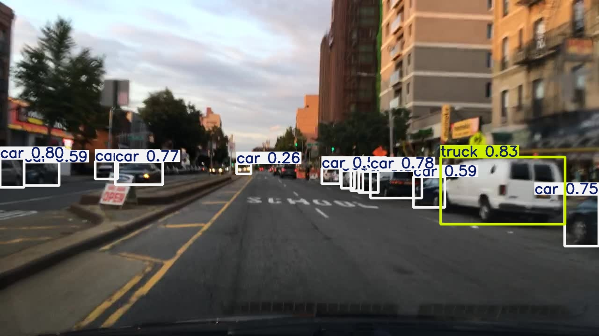
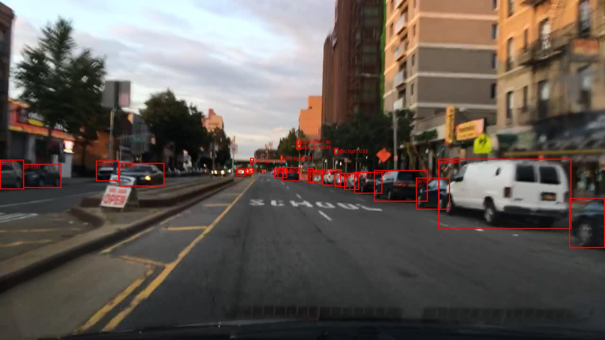

# Road Object Detection for Autonomous Driving

This project focuses on real-time road object detection for autonomous driving using YOLOv8n and RT-DETR (R101-VD).  
Both models are trained and evaluated on a curated version of the BDD100K dataset to detect 8 critical traffic-related object classes.

## Object Classes

The original label set from the BDD100K dataset contained 10 classes. For this project, it was reduced to 8 classes with the following modifications:
- The **Train** class was removed due to its rare occurrence and low relevance to the task.
- The **Motorcycle** and **Bicycle** classes were combined into a single class called **Two-wheeler**, as they share similar visual features and behavior.

The final set of 8 classes used in this project is:
1. Passenger car  
2. Traffic sign  
3. Traffic light  
4. Pedestrian  
5. Truck  
6. Bus  
7. Two-wheeler (bicycle or motorcycle)  
8. Rider on two-wheeler

This reduction helps improve training efficiency and model performance by minimizing class imbalance and category overlap.

## Repository Structure

| File | Description |
|------|-------------|
| [preprocessing.ipynb](preprocessing.ipynb) | Cleans BDD100K annotations, applies balancing techniques, and prepares formats for YOLOv8 and RT-DETR training |
| [yolov8_training.ipynb](yolov8_training.ipynb) | Fine-tunes YOLOv8n on BDD100K using Ultralytics interface. Tracks training metrics (mAP, recall, precision) and saves model checkpoints |
| [rtdetr_training.ipynb](rtdetr_training.ipynb) | Fine-tuning RT-DETR using Hugging Face and PyTorch and saves model checkpoints |
| [yolov8_inference.ipynb](yolov8_inference.ipynb) | Inference and visualization for YOLOv8 |
| [rtdetr_inference.ipynb](rtdetr_inference.ipynb) | Inference and visualization for RT-DETR, latency measurement |
| [rtdetr_evaluation.ipynb](rtdetr_evaluation.ipynb) | Evaluation of RT-DETR model (mAP, precision, recall) |
| [images/](images/) | Example output images from models |
| [requirements.txt](requirements.txt) | Project dependencies |
| [DaryaParanina_RoadObjectDetection_Thesis2025.pdf](DaryaParanina%20RoadObjectDetection%20Thesis2025.pdf) | Master's thesis, full text (available for download) |
| [DaryaParanina_RoadObjectDetection_Thesis2025.pptx](DaryaParanina%20RoadObjectDetection%20Thesis2025.pptx) | PowerPoint presentation from the project defense (available for download) |

## Training Details

**Environment:**
- Python, PyTorch
- Development platform: Jupyter Notebook
- GPU: NVIDIA GTX 1630
- Training type: Full fine-tuning (no frozen layers)
- Auxiliary libraries: Pillow, OpenCV, Matplotlib, PyTorch
- Frameworks: Ultralytics YOLO, Hugging Face Transformers
- Dataset: BDD100K (road object detection)

**YOLOv8n:**
- Epochs: 25  
- Optimizer: SGD  
- Batch size: 16  
- Image size: 768×768 px  
- Training time: ~72 hours  

**RT-DETR-R101-VD:**
- Epochs: 10  
- Optimizer: AdamW  
- Batch size: 2  
- Image size: 512×512 px  
- Training time: ~90 hours  

## Example Results (more in /images)

## Model Comparison Results

| Model                     | Size     | Resolution | mAP@0.5 | mAP@[.5:.95] | Recall | Inference Time | FPS     |
|--------------------------|----------|------------|---------|--------------|--------|----------------|---------|
| YOLOv8n                  | 5.94 MB  | 768×768    | 0.569   | 0.324        | 0.511  | 9.6 ms         | >100 FPS |
| RT-DETR-R101-VD (HF)     | 293.1 MB | 512×512    | 0.537   | 0.307        | 0.454  | 158.7 ms       | 6.3 FPS  |

Both YOLOv8n and RT-DETR (R101-VD) achieved acceptable detection accuracy for research purposes (mAP@0.5 > 0.5), confirming their suitability for road object detection tasks.

YOLOv8n showed a better trade-off for limited hardware: faster training, smaller model size, and real-time inference speed (>100 FPS on CPU).  
RT-DETR (R101-VD) has the potential for higher accuracy, but requires significantly more resources, achieving less than 15 FPS in inference on CPU.  
This highlights the practical advantage of lightweight architectures like YOLOv8n in real-time applications without GPU acceleration.

## About

Project by **Darya Paranina**, MSc in Artificial Intelligence (Siberian Federal University, 2025)

Master's thesis, full text (available for download): [DaryaParanina_RoadObjectDetection_Thesis2025.pptx.pdf](DaryaParanina%20RoadObjectDetection%20Thesis2025.pptx.pdf)

PowerPoint presentation from the project defense (available for download): [DaryaParanina_RoadObjectDetection_Thesis2025.pptx.pptx](DaryaParanina%20RoadObjectDetection%20Thesis2025.pptx.pptx)

[GitHub](https://github.com/odarapara-ml)
